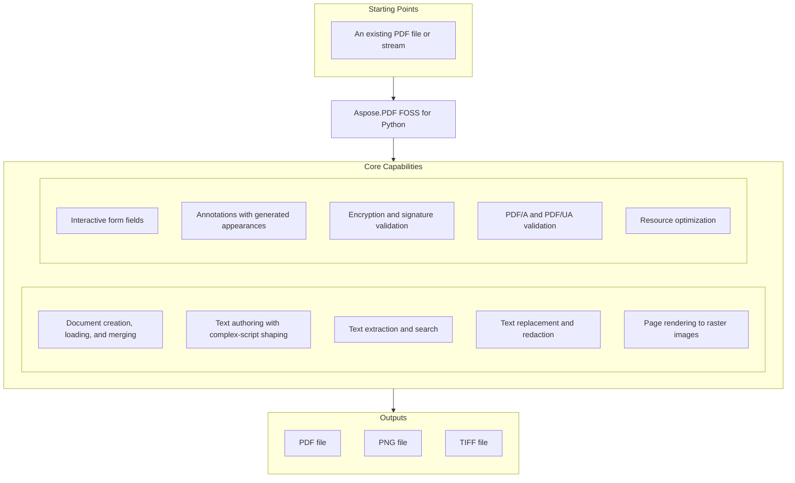

# Aspose.PDF FOSS for Python

[](https://github.com/aspose-pdf-foss/Aspose-PDF-FOSS-for-Python/actions/workflows/ci.yml) [](https://www.python.org/downloads/) [](LICENSE)

[](https://products.aspose.org/pdf/python/)

Aspose.PDF FOSS for Python is an open-source, MIT-licensed Python library for creating, reading,
editing, rendering, and validating PDF documents. It targets Python 3.11 and later, ships type
information (`py.typed`), and depends only on `cryptography` and `asn1crypto` at its core. The
project is currently in alpha, so its public APIs and feature coverage continue to evolve ahead
of a first stable release.

## Navigation

- [At a Glance](#at-a-glance)
- [Key Capabilities](#key-capabilities)
- [Installation](#installation)
- [Dependencies](#dependencies)
- [Quick Start](#quick-start)
- [Additional Examples](#additional-examples)
- [API Reference](#api-reference)
- [Documentation & Resources](#documentation--resources)
- [Scope and Limitations](#scope-and-limitations)
- [Development and Testing](#development-and-testing)
- [License](#license)

## At a Glance



## Key Capabilities

- The `Document` class is the central entry point: `Document(source, password=..., limits=...)`
  creates a new PDF or loads an existing one from a file path, raw bytes, or a binary stream —
  equivalent to `Document().load_from(source, ...)` — and merges instances together — a missing
  file, non-PDF data, or a missing password always raises rather than silently handing back an
  empty document.
- `Page.add_text()` places Standard-14 or embedded Unicode text on a page. Feed it a
  `FontDescriptor`, raw font bytes, or a path to author Unicode text through a subset Type0/CID
  font — the writer emits two-byte character codes, `/ToUnicode`, and the CID-to-glyph mapping —
  and, with the optional `text-layout` extra, pass `TextLayoutOptions` for HarfBuzz-driven
  OpenType shaping, Unicode bidi runs, ordered font fallback, and width-constrained line
  wrapping; a character the font can't represent raises `FontEmbeddingException` instead of
  silently falling back to `.notdef`.
- `PdfExtractor` pulls all page text with `get_text()` or walks it page by page (reading each page
  through the engine, so lazily loaded and damaged pages are read too), extracts embedded images as
  real image files (`extract_image()`/`get_next_image(destination=None)`) and file attachments
  (`extract_attachment()`/`get_attach_names()`), while `TextFragmentAbsorber` runs exact-phrase or
  regex searches and reports match offsets, page indices and where the text sits.
- `Document.replace_text()` and `Document.redact_text()` rewrite or remove matched text directly
  inside existing content streams; `redact_text(..., overlay=True)` also draws a filled bar over
  each removed run's location.
- `Page.render()` and `Page.save_as_image()` rasterize a page to PNG or TIFF through a bundled
  renderer — no third-party rasterization library required for the core path — that fills real
  glyph outlines, honors soft masks and blend modes, and paints axial, radial, and mesh shadings.
- `Document.save_as_html()`, `Document.save_as_markdown()`, and `Document.save_as_svg()` (also
  reachable through `Document.save()` with `DocFormat.HTML`/`MARKDOWN`/`SVG`) export structure and
  vector content directly — no PPTX conversion path exists.
- `Form`, `Field`, and `Document.flatten()` create, fill, and permanently bake AcroForm fields —
  text fields, checkboxes, radio groups, list boxes, combo boxes, and push buttons — into static
  page content.
- `Annotation` and `AnnotationCollection` read, add, and auto-generate `/AP /N` appearance
  streams for the standard shape and text-markup annotation subtypes.
- `Document.encrypt(..., algorithm=...)` and `Document.decrypt()` apply and remove standard-handler
  password protection — AES-256 (`/V 5 /R 6`) by default, AES-128 or 128-bit RC4 on request — and
  every standard-handler flavour, including 40-bit RC4 and owner-password-only documents, can be
  opened. Encryption is applied as the document is serialised, per object, so an encrypted save
  keeps the form fields, attachments, layers and tags of the document it was given, signatures
  included; `Document.sign()`, `add_ltv()` and `add_document_timestamp()` sign a document up to
  PAdES-LTA without breaking the signatures it already has, and `PdfSignature.validate()`
  cryptographically verifies a signer's identity, trust chain, revocation status, and PAdES
  conformance level.
- `Document.validate_pdfa()`, `Document.convert_to_pdfa()`, `Document.validate_pdfua()`, and
  `Document.auto_tag()` run heuristic PDF/A and PDF/UA compliance checks and generate a structure
  tree for existing content.
- `Document.optimize()` (aliased `optimize_resources()`) removes unreachable objects,
  deduplicates images, subsets embedded TrueType and CFF fonts, and recompresses streams, all
  controlled through `OptimizationOptions`.
- The `aspose_pdf.lowcode` plugin layer (`Merger`, `Splitter`, `Optimizer`, `TextExtractor`)
  wraps common batch workflows behind a uniform `DataSource`/`ResultContainer` interface.
- `PdfLoadLimits` bounds input size, object counts, decoded-stream bytes, and image pixels when a
  `Document` loads untrusted PDF input, raising `PdfResourceLimitException` instead of hanging or
  silently truncating a hostile file.

## Installation

Install directly from a clone of the repository:

```bash
git clone https://github.com/aspose-pdf-foss/Aspose-PDF-FOSS-for-Python.git
cd Aspose-PDF-FOSS-for-Python
python3 -m venv .venv
source .venv/bin/activate
python -m pip install -e '.[dev]'
```

Requires Python 3.11 or newer. The core package depends only on `cryptography` and `asn1crypto`.
Optional extras add:

```bash
python -m pip install -e '.[images,woff2,text-layout]'
```

- `images` — Pillow-based image support (JPX/JPEG 2000 decoding, arithmetic-coded JPEG).
- `woff2` — Brotli-based WOFF2 web-font decoding.
- `text-layout` — HarfBuzz/`python-bidi`/`fonttools`-based complex-text shaping for
  `TextLayoutOptions`.

## Dependencies

### Required Package Dependencies

- `cryptography` >=50
- `asn1crypto` >=1.5

### Optional Dependencies

- `Pillow` >=12.3 — enables the `images` extra (JPX/JPEG 2000 decoding, arithmetic-coded JPEG).
- `Brotli` >=1.2 — enables the `woff2` extra (WOFF2 web-font decoding).
- `uharfbuzz` >=0.37 — enables the `text-layout` extra (HarfBuzz-driven complex-text shaping).
- `python-bidi` >=0.6 — enables the `text-layout` extra (Unicode bidi runs).
- `fonttools` >=4.60.2 — enables the `text-layout` extra (font introspection for shaping).
- `atheris` >=2.3 — enables the `fuzz` extra (fuzz-testing harness).

### Native and System Requirements

- Python 3.11 or later (`requires-python = ">=3.11"` in `pyproject.toml`).

### Development Dependencies

- `build` >=1.2
- `pytest` >=8
- `ruff` >=0.6
- `setuptools` >=83
- `twine` >=5
- `wheel`
- `Brotli` >=1.2 — needed to test the `woff2` extra.
- `fonttools` >=4.60.2 — needed to test the `text-layout` extra.
- `Pillow` >=12.3 — needed to test the `images` extra.
- `uharfbuzz` >=0.37 — needed to test the `text-layout` extra.
- `python-bidi` >=0.6 — needed to test the `text-layout` extra.
- `reportlab` >=4.2 — imported by `scripts/build_agl_data.py`.

## Quick Start

Create a PDF and add positioned text:

```python
from aspose_pdf import Document

with Document() as document:
    page = document.pages.add()
    page.add_text(
        "Hello from Aspose.PDF FOSS!",
        x=72,
        y=720,
        font_size=18,
    )
    document.save("hello.pdf")
```

A document loads just as easily from an existing path, in-memory bytes, or a binary stream:

```python
from aspose_pdf import Document

with Document("input.pdf") as document:
    print(f"Pages: {document.page_count}")
    print(f"PDF version: {document.version}")
    print(document.info)
```

`Document(source, password=..., limits=...)` is equivalent to `Document().load_from(source, ...)`
— a missing file, non-PDF data, or a missing password raises rather than handing back a silently
empty document.

## Additional Examples

More real, runnable examples from the project's own documentation are collected below.

### Render a Page to an Image

```python
from aspose_pdf import Document

with Document() as document:
    document.load_from("input.pdf")
    document.pages[0].save_as_image("page-1.png", dpi=144)
```

<details>
<summary>View Additional Examples</summary>

### Encrypt for Certificate Recipients

```python
from pathlib import Path

from cryptography import x509
from aspose_pdf import Document, Recipient

auditor = x509.load_pem_x509_certificate(Path("auditor.pem").read_bytes())
reviewer = x509.load_pem_x509_certificate(Path("reviewer.pem").read_bytes())

with Document("report.pdf") as document:
    document.encrypt_for_recipients([
        Recipient(auditor),                      # every permission
        Recipient(reviewer, permissions=-3844),  # read and print only
    ])
    document.save("report-sealed.pdf")

# Opening needs the certificate and its private key, not a password.
with Document("report-sealed.pdf", certificate=auditor, private_key=key) as doc:
    print(doc.page_count, doc.permissions)
```

### Sign a Document

```python
from pathlib import Path

from cryptography.hazmat.primitives.serialization import pkcs12
from aspose_pdf import Document

key, certificate, chain = pkcs12.load_key_and_certificates(
    Path("signer.p12").read_bytes(), b"p12-password"
)

with Document("contract.pdf") as document:
    document.sign(
        "Approval",                      # an unsigned signature field; omit for an invisible one
        certificate=certificate,
        private_key=key,
        extra_certificates=chain,
        reason="Approved",
        pades=True,
        timestamp_url="http://timestamp.example/rfc3161",  # PAdES-T
    )
    document.add_ltv()                   # the chain and revocation data into /DSS: PAdES-LT
    document.add_document_timestamp(timestamp_url="http://timestamp.example/rfc3161")  # PAdES-LTA
    document.save("contract-signed.pdf")  # each step is an appended revision
    print([signature.valid for signature in document.signatures])
```

### Put a Watermark on a Layer, Then Resolve It

```python
from aspose_pdf import Document

with Document("report.pdf") as document:
    draft = document.layers.add("Draft", visible=False)
    with document.pages[0].layer(draft):
        document.pages[0].add_text("DRAFT", 150, 400, font_size=64)
    document.save("with-layers.pdf")

    # ...and when the file has to leave: hidden means gone, not merely hidden.
    document.layers["Draft"].visible = False
    document.flatten_layers()
    document.save("final.pdf")
```

### Convert a Document to HTML or Markdown

```python
from aspose_pdf import Document

with Document("report.pdf") as document:
    document.save_as_markdown("report.md")
    # Images as files in report_files/ rather than data: URIs; one HTML file per page.
    document.save_as_html("report.html", resources_directory="report_files", split_into_pages=True)
    print(document.to_markdown(pages=[0], markdown_format="CommonMark"))
```

### Export a Page as SVG

```python
from aspose_pdf import Document

with Document("report.pdf") as document:
    document.pages[0].save_as_svg("page-1.svg")
    document.save_as_svg("report.svg")  # one file per page: report-1.svg, ...
```

### Render a Page Whose Fonts Are Not Embedded

```python
from aspose_pdf import Document, FontSubstitutionOptions

with Document("report-cjk.pdf") as document:
    # Use the machine's own fonts; FontSubstitutionOptions(["/opt/fonts"]) or
    # FontSubstitutionOptions(fonts={"SimSun": data}) keep it reproducible.
    document.font_substitution = FontSubstitutionOptions.system()
    document.save_page_as_image(0, "page-1.png", dpi=144)
```

### Author Multi-Script Unicode Text

```python
with Document() as document:
    page = document.pages.add()
    page.add_text(
        "Latin Č · Кириллица · Ελληνικά · 漢字",
        x=72,
        y=720,
        font="NotoSans-Regular.ttf",
    )
    document.save("unicode.pdf")
```

### Author Complex-Script Text With TextLayoutOptions

```python
from aspose_pdf import Document, TextLayoutOptions

with Document() as document:
    page = document.pages.add()
    page.add_text(
        "English العربية 123",
        x=72,
        y=720,
        font_size=16,
        font="NotoSansArabic-Regular.ttf",
        layout=TextLayoutOptions(
            fallback_fonts=["NotoSans-Regular.ttf"],
            max_width=300,
            alignment="start",
            language="ar",
        ),
    )
    document.save("complex-text.pdf")
```

### Extract Text From a PDF

```python
from aspose_pdf import PdfExtractor

with PdfExtractor() as extractor:
    extractor.bind_pdf("input.pdf")
    extractor.extract_text()
    print(extractor.get_text())
```

### Merge PDF Files

```python
from aspose_pdf import PdfFileEditor

with PdfFileEditor() as editor:
    if not editor.concatenate(["part-1.pdf", "part-2.pdf"], "merged.pdf"):
        raise RuntimeError(editor.last_exception)
```

### Apply Resource Limits for Untrusted PDF Input

```python
from aspose_pdf import Document, PdfLoadLimits, PdfResourceLimitException

limits = PdfLoadLimits(
    max_input_bytes=64 * 1024 * 1024,
    max_decoded_stream_bytes=16 * 1024 * 1024,
    max_image_pixels=25_000_000,
)

try:
    with Document(limits=limits) as document:
        document.load_from("input.pdf")
except PdfResourceLimitException as error:
    print(f"PDF rejected: {error}")
```

</details>

## API Reference

The `Document` class is the central entry point — it exposes `pages`, `form`, `outlines`, and
`tagged_content` for structural editing alongside `encrypt`, `decrypt`, `merge`, `optimize`, and
`flatten` operations. `PdfExtractor` handles text, image, and attachment extraction, and
`PdfFileEditor` provides a boolean-returning facade for file-based concatenate, extract, insert,
and delete workflows. 265 public types are organized by module below.

<details>
<summary>View the Core API Surface</summary>

### Core API

| Class | Description |
|---|---|
| `Action` | Base class for an interactive action. |
| `AsposePdfException` | Base class for all aspose_pdf exceptions. |
| `ByteArrayDataSource` | A data source backed by in-memory bytes. |
| `CdrLoadOptions` | Options for loading CDR files. |
| `CertificationLevel` | DocMDP certification level of a signature. |
| `CgmLoadOptions` | Options for loading CGM files. |
| `ColorPrimitive` | Very small color primitive with transparency support. |
| `DataSource` | Base class for plugin inputs and outputs. |
| `DeprecatedFeatureException` | Raised when a deprecated PDF feature is used that is not allowed in newer PDF versions. |
| `Destination` | Base class for a view destination on a document page. |
| `DocFormat` | Target format for a save operation. |
| `Document-document` | Pythonic wrapper for PDF document lifecycle and core operations. |
| `Duplex` | Enum with 4 members. |
| `Field` | A field of an interactive form. |
| `FieldType` | Type of form field. |
| `FileDataSource` | A data source backed by a file on disk. |
| `FileFontSource` | Discover the font(s) contained in a single file. |
| `FileSpecification` | A document-level embedded file (``/Filespec``) with typed metadata. |
| `FillMode` | Fill mode enumeration for path operations. |
| `FitBDestination` | Fit the page's bounding box in the window. |
| `FitBHDestination` | Fit the bounding-box width with `top` at the top of the window. |
| `FitBVDestination` | Fit the bounding-box height with `left` at the left of the window. |
| `FitDestination` | Fit the whole page in the window. |
| `FitHDestination` | Fit the page width with `top` at the top of the window. |
| `FitRDestination` | Fit the rectangle `(left, bottom, right, top)` in the window. |
| `FitVDestination` | Fit the page height with `left` at the left of the window. |
| `FolderFontSource` | Collect fonts from a directory (optionally recursing into subfolders). |
| `FontDescriptor` | Represents a discoverable font. |
| `FontEmbeddingException` | Raised when there is an error embedding fonts in the PDF. |
| `FontRegistry` | Singleton registry for resolving well-known font names. |
| `FontRepository` | Aggregate font sources and resolve fonts by name. |
| `FontSource` | Base class for external font providers. |
| `FontSubstitutionOptions` | Font sources the renderer may substitute from. |
| `Form` | Represents an interactive form (AcroForm) within a PDF document. |
| `FormType` | Type of PDF form. |
| `GoToAction` | Jump to a destination within this document. |
| `GoToRAction` | Jump to a destination in another (remote) PDF file. |
| `GradientAxialShading` | Represents axial (linear) gradient shading. |
| `GraphicElement` | A painted path or a placed image, read from a page's content stream. |
| `GraphicElementCollection` | Collection of graphic elements that can be added to or removed from a page. |
| `GraphicsAbsorber` | Absorbs graphic elements from PDF pages. |
| `HtmlLoadOptions` | Options for loading HTML documents. |
| `HtmlSaveOptions` | Options for saving PDF documents as HTML. |
| `ImagePlacement-images` | Represent an image placed on a PDF page. |
| `ImagePlacementAbsorber-images` | Absorber to collect image placements from PDF pages. |
| `IncorrectCMapUsageException` | Raised when there is an incorrect usage of CMap. |
| `InvalidFormTypeOperationException` | Exception thrown when an invalid form type operation is attempted. |
| `InvalidOperationException` | Raised when a graphics element is attached to the wrong parent. |
| `InvalidPasswordException` | Raised when an incorrect password is provided for an encrypted document. |
| `Layer` | One optional content group: its name, intent, whether it is shown, and `add`/`remove`/`contains` for tagging existing content with it. |
| `LayerCollection` | The document's layers: indexable by position or by name, with `add(name, visible)`, `remove(layer)` and `make_exclusive(layers)`. |
| `InvalidPdfFileFormatException` | Raised when the PDF file format is invalid or corrupted. |
| `InvalidValueFormatException` | Raised when an invalid value is encountered during parsing or conversion. |
| `JavaScriptAction` | Run a JavaScript script (serialized verbatim, not validated). |
| `LatexFragment` | Small value object that stores LaTeX source text. |
| `LaunchAction` | Launch an application or open a file (serialized verbatim). |
| `Layer` | One optional content group, and whether it is currently shown. |
| `LayerCollection` | The document's layers, indexable by position or by name. |
| `License` | License management class for Aspose.PDF. |
| `Margin` | The Margin class provides top, left, bottom, and right properties for defining page margins. |
| `MarkdownSaveOptions` | Class with 1 method and 4 properties. |
| `Matrix3D` | Represents a 3D transformation matrix. |
| `MemoryFontSource` | Expose a font program supplied as in-memory bytes. |
| `MergeOptions` | Options for :class:`Merger`: concatenate all inputs in order. |
| `Merger` | Concatenate every input PDF into a single document. |
| `NamedAction` | A predefined named action. |
| `NamespaceProvider` | Resolve XMP namespace prefixes and URIs. |
| `OfdLoadOptions` | Options for loading OFD files. |
| `OperationResult` | A single result produced by a plugin. |
| `OptimizationOptions` | OptimizationOptions lets developers control stream compression, removal of unused objects, image down‑sampling, and other cleanup actions when optimizing PDFs. |
| `OptimizeOptions` | Options for :class:`Optimizer`. |
| `Optimizer` | Optimize each input PDF (compression + unused-object cleanup). |
| `OutlineCollection` | Top-level collection of :class:`OutlineItem` bookmarks. |
| `OutlineItem` | A single bookmark entry in a PDF outline tree. |
| `PadesLevel` | PAdES baseline conformance level reached by a signature. |
| `Page` | A page of a PDF document. |
| `PageCollection` | A collection to manage PDF pages within a Document. |
| `PageInfo` | Class with 1 property. |
| `PdfAConversionResult` | Result of a PDF/A conversion operation. |
| `PdfAValidateOptions-pdfa` | Container for PDF/A validation settings. |
| `PdfAValidationResult-pdfa` | Detailed result of a PDF/A validation run. |
| `PdfAValidator` | Plugin that runs PDF/A validation on one or more inputs. |
| `PdfConsts` | Class with 2 methods. |
| `PdfException` | Base class for PDF-related exceptions. |
| `PdfExtractor` | Simple PDF text and image extractor. |
| `PdfFileEditor` | Facade for PDF file editing operations. |
| `PdfIOException` | Raised when there is an I/O error during PDF processing. |
| `PdfLoadLimits` | Immutable safety limits for untrusted PDF input and authored assets. |
| `PdfParseException` | Raised when there is an error parsing a PDF document. |
| `PdfPlugin` | Base class for low-code plugins. |
| `PdfResourceLimitException` | Raised when processing a PDF would exceed a configured resource limit. |
| `PdfSecurityException` | Raised when there is an encryption, signature, or permissions error. |
| `PdfSignature` | Represent a PDF digital signature. |
| `PdfUaValidateOptions` | Container for batch PDF/UA validation settings. |
| `PdfUaValidationResult` | Detailed result of a PDF/UA structure check (heuristic). |
| `PdfUaValidator` | Plugin that runs heuristic PDF/UA validation on one or more inputs. |
| `PdfValidationException` | Raised when a PDF document fails validation or compliance checks. |
| `PerformanceLogger` | Class with 2 methods and 1 property. |
| `Plugin` | Identifiers for the available low-code plugins. |
| `PluginOptions` | Hold input/output data sources and their PDF resource-limit policy. |
| `Point` | Represents a point in 2D space. |
| `Point3D` | Represents a 3D point. |
| `PrinterSettings` | Class with 11 properties. |
| `PrintRange` | Enum with 4 members. |
| `Recipient` | One certificate that may open the document, and what it may then do. |
| `Rectangle` | Rectangle representing image placement bounds on a PDF page. |
| `RegexResult` | Wraps a single regular-expression match found on a PDF page. |
| `ResetFormAction` | Reset the form's fields to their default values. |
| `ResultContainer` | Holds the ordered results of a plugin operation. |
| `RevocationStatus` | Certificate revocation outcome (OCSP/CRL). |
| `SaveFormat` | Format for saving PDF documents. |
| `SplitOptions` | Options for :class:`Splitter`: split the first input into single pages. |
| `Splitter` | Split the first input PDF into one document per page. |
| `StatisticsEntry` | Entry for tracking statistics and timing information. |
| `StreamDataSource` | A data source backed by a binary stream (e.g. ``io.BytesIO``). |
| `StructureElement` | A mutable logical-structure element in a tagged PDF. |
| `StructureTypeStandard` | Enum with 15 members. |
| `SubmitFormAction` | Send the form's field values to a URL. |
| `SvgLoadOptions-load_options` | Options for loading SVG files. |
| `SvgLoadOptions-svg` | Class with 1 method and 2 properties. |
| `SystemFontSource` | Collect fonts from common system font directories. |
| `TaggedContent` | Editable view of a document's logical structure tree. |
| `TaggedContext` | Class with 4 properties. |
| `TextAbsorber` | Absorbs text from PDF pages (legacy class, alias for TextFragmentAbsorber). |
| `TextExtractionOptions` | Options for text extraction from PDF pages. |
| `TextExtractor` | Extract plain text from each input PDF. |
| `TextExtractorOptions` | Options for :class:`TextExtractor`: extract text from each input. |
| `TextFormattingMode` | Text formatting mode for text extraction. |
| `TextFragment` | A text fragment found inside a PDF page. |
| `TextFragmentAbsorber-text` | Absorbs text fragments from a PDF page or document. |
| `TextFragmentCollection` | A mutable ordered collection of :class:`TextFragment` objects. |
| `TextLayoutOptions` | Configure complex-text shaping and line layout for ``Page.add_text``. |
| `TextSearchOptions` | Options controlling how text search is performed. |
| `TrustStatus` | Outcome of building/validating the signer's certificate chain. |
| `UnsignedContent-forms` | Represents a collection of unsigned content elements in a PDF document. |
| `UnsignedContentAbsorber-forms` | Extract unsigned form fields and annotations from a PDF document. |
| `UnsupportedFeatureException` | Raised when a compatibility surface names a feature this package lacks. |
| `URIAction` | Resolve a uniform resource identifier (typically a web link). |
| `ValidationMethod` | Selects the signature format / validation algorithm. |
| `ValidationMode` | Controls whether certificate revocation is checked via network. |
| `ValidationOptions` | Configuration for signature validation. |
| `ValidationResult` | Structured result returned by signature validation. |
| `ValidationStatus` | Outcome of a :class:`ValidationResult`. |
| `VirtualizationPerformance` | Class with 5 methods. |
| `WarichuWPElement` | Minimal tagged-element type for API compatibility. |
| `XYZDestination` | Position `(left, top)` at the upper-left with an optional zoom. |


### Annotations

| Class | Description |
|---|---|
| `Annotation` | Live view over a single annotation on a page. |
| `AnnotationCollection` | Mutable sequence-like wrapper over page annotations. |
| `LinkAnnotation` | Concrete annotation type kept for compatibility with tests/API. |
| `MarkupAnnotation` | Base class for markup annotations. |
| `PDF3DAnnotation` | Minimal annotation wrapper for prerelease imports. |
| `PDF3DArtwork` | Container for 3D content and named views. |
| `PDF3DContent` | Reference to 3D content stored on disk. |
| `PDF3DView` | Lightweight description of a saved 3D view. |

#### Enumerations

| Enumeration | Description |
|---|---|
| `AnnotationFlags` | Flags that define annotation behaviour. |
| `AnnotationType` | Known annotation subtype names (PDF 32000-1:2008, Table 169). |
| `PDF3DLightingScheme` | Enum with 5 members. |
| `PDF3DRenderMode` | PDF3DRenderMode and PDF3DLightingScheme enums let developers choose rendering style (SOLID, WIREFRAME, TRANSPARENT) and lighting (HEADLAMP, WHITE, etc.) for 3D annotations. |

---

### Clustering

| Class | Description |
|---|---|
| `Cluster` | Represents a cluster of data points. |
| `ClusterCollection` | A collection of clusters. |
| `DataPoint` | Represents a data point in clustering operations. |

---

### Engine

| Class | Description |
|---|---|
| `AbsorbedElement` | One painted path or placed image, in page (user) space. |
| `AnnotationName` | A ``str`` subclass that marks a value to be serialized as a PDF name. |
| `AuthoredFont` | A normalized embedded font and the mutable CID mapping for authored text. |
| `AuthoredImage` | Prepared image data and PDF image XObject metadata. |
| `BitStream` | Minimal bit-oriented buffer used by compatibility code. |
| `Block` | One piece of exported structure. |
| `CffOutlines` | Decode glyph outlines from a CFF (Type 2 charstring) font program. |
| `ChainResult` | Result of building and validating a certificate path. |
| `CharacterCollection` | A CIDSystemInfo registry, ordering, and supplement triple. |
| `CidTextCodec` | Code codec for a composite (Type0) font's show strings. |
| `Codestream` | Class with 2 methods and 8 properties. |
| `Color` | Represents a color in PDF documents. |
| `CompositeFontMetric` | Advance metrics for a composite (Type0) font. |
| `ContentStreamParser` | Parse a PDF content stream and extract plain text. |
| `CosExtractor` | Extract pages, streams, images and metadata from a PdfDocument. |
| `DecodedImage` | A decoded JPEG 2000 image as interleaved 8-bit samples. |
| `DecodedJpeg` | A decoded JPEG image. |
| `Decoder-ccitt` | Decoder.decode(data, params, limits) returns the raw bytes of a decoded stream for supported codecs like JBIG2 and JPEG 2000. |
| `Decoder-jbig2` | JBIG2 decoder that parses segment structure and extracts bitmap data. |
| `Decoder-jpx` | JPEG 2000 (JPX) Stream Decoder. |
| `DssMaterial` | Validation material destined for (or harvested from) a ``/DSS``. |
| `Encoding` | Class with 1 method and 4 members. |
| `EncodingType` | Enum with 5 members. |
| `EncryptionUtils` | Utility class for PDF-compliant AES-CBC, RC4 encryption, and key derivation. |
| `FilterType` | The FilterType enum lists the supported stream filter names such as FLATE_DECODE, LZW_DECODE, and DCT_DECODE. |
| `FontResolver` | Index external font sources and resolve PDF font names against them. |
| `GeneratedAppearance` | A synthesised appearance: content bytes plus any required ExtGState entries. |
| `GlyphPlacement` | One shaped glyph at an em-relative position within a laid-out line. |
| `ImagePlacement-simple_pdf` | Represents an image placement on a page. |
| `ImagePlacementAbsorber-simple_pdf` | Absorber that finds image placements in a PDF. |
| `IncrementalUpdate` | Generate an incremental update section for an existing PDF. |
| `IncrementalWriter` | Utility that appends incremental updates to an existing PDF. |
| `Jpeg2000Error` | A JPEG 2000 codestream that cannot be decoded. |
| `LayoutElement` | A positioned piece of page content (a text object or an image paint). |
| `LayoutLine` | One visual line with logical replacement text and shaped glyphs. |
| `LayoutResult` | Complete line layout; glyph coordinates and widths are in em units. |
| `LazyImageDict` | Dictionary that decodes image streams on demand to save memory. |
| `LazyPdfObjectStore` | Object-number → COS object map that parses from a :class:`PdfCosParser` on demand. |
| `Matrix` | Matrix supports 2‑D transformations with translate(x, y) and multiply(other) methods, exposing the a‑f components of the affine matrix. |
| `MQDecoder` | The MQ arithmetic decoder of Annex C. |
| `OptionalContent` | The document's optional content groups and their default visibility. |
| `OptionalContentGroup` | One optional content group (`/OCG`) of the document. |
| `ParseWarnings` | Collects warnings during parsing. |
| `PdfArray` | PdfArray provides an items collection and an append method to build PDF array objects. |
| `PdfBoolean` | PdfBoolean represents a PDF boolean value via its 'value' property. |
| `PdfCorruptedError` | Unrecoverable PDF corruption. |
| `PdfCosParser` | Parse a PDF file (bytes) into a :class:`PdfDocument`. |
| `PdfCosWriter` | Serialize a :class:`PdfDocument` to a PDF byte sequence. |
| `PdfDictionary` | PdfDictionary behaves like a mapping with get and pop methods to access entries. |
| `PdfDocument` | Container for a PDF's COS object graph. |
| `PdfEncodingError` | Font or content stream encoding error. |
| `PdfIndirectReference` | PdfIndirectReference exposes the object number and generation number of an indirect PDF object. |
| `PdfMalformedError` | Recoverable malformed PDF structure. |
| `PdfName` | Represents a PDF name object. |
| `PdfNull` | Represent PDF null object. |
| `PdfNumber` | Represents a PDF number primitive (integer or real). |
| `PdfObject` | Base class for all PDF COS objects. |
| `PdfObjectID` | Class with 2 properties. |
| `PdfObjectRegistry` | PdfObjectRegistry.register(obj) returns a PdfObjectID that uniquely identifies the stored PDF object within the registry. |
| `PdfParseError` | Base exception for PDF parsing errors. |
| `PdfParseWarning` | Non-fatal parsing issue that was recovered from. |
| `PdfSecurityError` | Encryption or permission related error. |
| `PdfStream` | Class with 3 methods and 2 properties. |
| `PdfString` | Class with 1 method and 1 property. |
| `PdfTrailerable` | Class with 1 method. |
| `PdfValidationError` | PDF/A or general structural validation error. |
| `PdfWriterV0` | Writes SimplePdf to PDF 1.7 format. |
| `PredefinedCMap` | A resolved predefined CMap and its semantic Unicode mapping. |
| `PredefinedCMapEncoding` | Compact code-to-CID view of a predefined CMap. |
| `RasterizedPage` | A rendered PDF page in packed RGB format. |
| `RecipientPayload` | What one opened envelope carries. |
| `Reshaper` | Policy for shaping complex-script replacements during a text edit. |
| `ResolvedFace` | A font program picked for a non-embedded PDF font. |
| `RevocationResult` | Class with 3 properties. |
| `RichRun` | Class with 2 properties. |
| `RichStyle` | The resolved style of a text run. |
| `SfntFace` | Metadata recovered from a single SFNT face. |
| `Shading` | Base class for bounded RGB sampling in a shading's target space. |
| `SignedDataInfo` | Everything we need from a parsed CMS ``SignedData``. |
| `SignerVerification` | Outcome of verifying a single signer. |
| `SigningUtils` | Utility class for generating certificates and PKCS#7 signatures. |
| `SimpleFontMetric` | Advance metrics for a single-byte simple font, in 1000-unit glyph space. |
| `SimplePdf` | Native Python PDF document representation. |
| `StandardFonts` | Utility class for the PDF Standard 14 fonts. |
| `StreamDecoder` | Decode PDF stream data using supported filters. |
| `StreamEncoder` | Encode raw bytes into PDF stream data, the inverse of :class:`StreamDecoder`. |
| `TagTree` | The tag tree of ISO 32000-2 clause 14.8, used for structure inclusion. |
| `TextFragmentAbsorber-simple_pdf` | Absorber that extracts text fragments from a SimplePdf instance. |
| `TextObject` | A ``BT`` ... ``ET`` text object located in a content stream. |
| `TiffPage` | One image in a TIFF file. |
| `TimestampInfo` | Result of verifying an RFC 3161 timestamp token. |
| `TrueTypeOutlines` | Decode glyph outlines from an embedded TrueType (``glyf``) program. |
| `Type1Outlines` | Decode glyph outlines from a Type 1 (``/FontFile``) font program. |
| `XmpArray` | An ordered XMP array value. |
| `XmpField` | A single XMP property. |
| `XmpNamespaceProvider` | Bidirectional XMP namespace prefix URI resolver. |
| `XmpPacket` | An in-memory XMP packet: an ordered collection of properties. |
| `XmpProperty` | A property carrying arbitrary qualifiers. |
| `XmpStruct` | A structured XMP value (an ``rdf:parseType="Resource"`` block). |


### Generated

| Class | Description |
|---|---|
| `Document-generated_document` | Re-export of `aspose_pdf.Document`. |
| `PdfAValidateOptions-generated_pdfa` | Re-export of `aspose_pdf.pdfa.PdfAValidateOptions`. |
| `PdfAValidationResult-generated_pdfa` | Re-export of `aspose_pdf.pdfa.PdfAValidationResult`. |
| `UnsignedContent-generated_forms` | Re-export of `aspose_pdf.forms.UnsignedContent`. |
| `UnsignedContentAbsorber-generated_forms` | Re-export of `aspose_pdf.forms.UnsignedContentAbsorber`. |

---

### Security

| Class | Description |
|---|---|
| `CompromiseCheckResult` | Class with 4 properties. |
| `SignaturesCompromiseDetector` | Detect possible compromise indicators around signed PDFs. |

---

#### Detailed Member Reference

### Document Lifecycle

- `Document`
  - `load_from(source, password, limits) -> Document` / `open_streaming(path, password, limits) -> Document`
  - `save(destination, save_format, overwrite) -> Document` / `merge() -> Document`
  - `optimize(options, compress_streams) -> Document` (alias `optimize_resources(options) -> Document`)
  - `encrypt(user_password, owner_password, permissions) -> Document` / `decrypt(password) -> Document` /
    `change_passwords(old_password, new_user_password, new_owner_password) -> Document`
  - `validate() -> bool` / `check() -> bool` / `repair() -> Document`
  - `validate_pdfa(level) -> PdfAValidationResult` / `convert_to_pdfa(level, font_lookup_directory) -> list[str]`
  - `validate_pdfua() -> PdfUaValidationResult` / `convert_to_pdfua(language, title, auto_tag) -> list[str]` /
    `auto_tag(image_alt) -> int`
  - `replace_text(search, replacement, page_index, case_sensitive, max_count) -> int` /
    `redact_text(search, page_index, case_sensitive, max_count, overlay, overlay_color) -> int`
  - `render_page(page_index, dpi, scale, background, antialias, shape_substitute_text, draw_annotations, font_substitution) -> RasterizedPage` /
    `save_page_as_image(page_index, destination, dpi, scale, background, antialias, mode, compression, quality, threshold) -> Path` /
    `save_as_tiff(destination, pages, dpi, scale, background, antialias, mode, compression, threshold) -> Path` /
    `save_as_svg(destination, pages, background, draw_annotations, font_substitution, precision, overwrite) -> list[Path]`
  - `to_html(pages, title, embed_images, paragraph_gap, clip_to_page) -> str` /
    `to_markdown(pages, title, embed_images, markdown_format, paragraph_gap, clip_to_page) -> str` /
    `save_as_html(destination, pages, title, embed_images, split_into_pages, resources_directory, paragraph_gap, clip_to_page, overwrite) -> list[Path]` /
    `save_as_markdown(destination, pages, title, embed_images, image_directory, markdown_format, paragraph_gap, clip_to_page, overwrite) -> Path`
  - `flatten() -> Document` / `generate_appearances(force) -> int` / `generate_field_appearances() -> int`
  - `iter_pages() -> Iterator[Page]` / `iter_page_content_streams() -> Generator[bytes, None, None]`
  - `sync_metadata(direction) -> Document` /
    `add_attachment(name, content, mime, description, creation_date, mod_date, compress) -> Document`
  - properties: `pages`, `page_labels`, `form`, `outlines`, `layers`, `tagged_content`, `load_limits`,
    `xmp_metadata`, `embedded_files`, `page_count`, `info`, `is_encrypted`, `permissions`,
    `is_pdfua_compliant`, `font_substitution`

### Pages And Content

- `Page`
  - `add_text(text, x, y, font_size, font_name, font, color, tag, actual_text, layout) -> Page`
  - `add_image(image, x, y, width, height, pixel_width, pixel_height, color_space, bits_per_component, name, tag, alt, actual_text) -> str`
  - `draw_rectangle(x, y, width, height, stroke_color, fill_color, line_width, tag, alt, actual_text) -> Page` /
    `draw_line(x1, y1, x2, y2, stroke_color, line_width, tag, alt, actual_text) -> Page`
  - `render(dpi, scale, background, antialias) -> RasterizedPage` /
    `save_as_image(path, dpi, scale, background, antialias) -> Path`
  - `replace_text(...) -> int` / `redact_text(...) -> int`
  - properties: `index`, `label`, `rect`, `media_box`, `crop_box`, `rotation`, `annotations`, `content`
- `PageCollection` — `item(index) -> Page`, `add(page) -> Page`, `insert(index, page) -> Page`,
  `delete(index) -> None`, `clear() -> None`, `contains(page) -> bool`, `index_of(page) -> int`
- `PageLabelCollection` (`Document.page_labels`) — a mutable mapping from the page a label range
  starts at to its `PageLabel(style, prefix, start)`; `NumberingStyle` names the five styles and
  `NONE`; `label(page_index) -> str | None`, `clear()`

### Text Extraction And Editing

- `PdfExtractor`
  - `bind_pdf(source, password, limits) -> None`
  - `extract_text() -> None` / `get_text() -> str` / `has_next_page_text() -> bool` / `get_next_page_text() -> str`
  - `extract_image() -> None` / `has_next_image() -> bool` / `get_next_image() -> Any`
  - `extract_attachment() -> None` / `get_attachment(name) -> Any` / `get_attach_names() -> list[str]`
- `TextFragmentAbsorber` / `TextAbsorber` — search exact phrases and regex patterns, collecting
  `TextFragment` results with page index, match offsets and, for a page of a document, where the
  text sits: `rect`, `quads`, `font_name`, `font_size`, `color`.
- `PdfFileEditor`
  - `concatenate(inputs, output) -> bool`
  - `extract(source, destination, page_from, page_to) -> bool` /
    `insert(source, insert_file, destination, position) -> bool` /
    `delete(source, destination, pages_to_delete, page_to, page_from) -> bool` /
    `append(source, append_source, destination) -> bool` / `add_page_break(input_path, output_path) -> bool`
  - property: `last_exception: BaseException | None` — the boolean-return / `last_exception` error
    contract this legacy facade keeps.

### Forms And Annotations

- `Form`
  - `add_text_field(name, page, rect, value, font_size, multiline, alignment, read_only, required) -> Field`
  - `add_checkbox(name, page, rect, checked, on_value, read_only, required) -> Field` /
    `add_radio_group(name, page, options, value, read_only, required) -> Field`
  - `add_list_box(...) -> Field` / `add_combo_box(...) -> Field` /
    `add_push_button(name, page, rect, caption, read_only, required) -> Field`
  - `remove_field(name) -> Field` / `generate_appearances() -> int` / `flatten() -> None`
  - `export_fdf(destination) -> bytes` / `export_xfdf(destination) -> bytes` /
    `import_fdf(source) -> list[str]` / `import_xfdf(source) -> list[str]` (form data interchange)
- `Field` — `remove() -> Field`; properties `name`, `value`, `field_type`, `partial_name`,
  `alternate_name`, `mapping_name`, `flags`, `read_only`, `required`, `no_export`, `default_value`,
  `max_length`, `multiline`, `password`, `comb`, `options`, `multi_select`, `editable`,
  `export_values`, `widgets` (`FieldWidget(page_index, rect)`), `page_index`, `rect`
- `Annotation` — `generate_appearance(force) -> bool`, `get_property(name, default) -> Any`,
  `set_property(name, value) -> None`; properties `subtype`, `rect`, `contents`, `appearance_normal`
- `AnnotationCollection` — `add(subtype, rect, contents, title, appearance_normal, properties) -> Annotation`,
  `insert(...)`, `delete(index) -> None`, `generate_appearances(force) -> int`

### Security And Signatures

- `Document.encrypt(user_password, owner_password, permissions)` / `Document.decrypt(password)` /
  `Document.change_passwords(...)`
- `Document.sign(field=None, *, certificate, private_key, extra_certificates, reason, location,
  contact, signer_name, pades, timestamp_url, timestamp_authority, timestamp_timeout, certify)`,
  `Document.add_ltv(certificates, crls, ocsp_responses)`,
  `Document.add_document_timestamp(timestamp_url | timestamp_authority)` — carried out by `save()`
  as appended revisions (PAdES-B/T/LT/LTA), after which `Document.signatures` lists them
- `PdfSignature.validate(options) -> ValidationResult`; properties `valid`, `name`, `date`, `docmdp_level`
- `ValidationResult` — properties `is_valid`, `status`, `trust_status`, `revocation_status`,
  `certification_level`, `pades_level`
- `PdfLoadLimits` — immutable resource policy; `PdfLoadLimits.unlimited()` disables every field;
  covers `max_input_bytes`, `max_objects`, `max_decoded_stream_bytes`, `max_image_pixels`, and 12
  more bounded resources.

### Low-Code Plugins

- `Merger`, `Splitter`, `Optimizer`, `TextExtractor` — each a `PdfPlugin` subclass exposing
  `process(options) -> ResultContainer`.
- `FileDataSource`, `ByteArrayDataSource`, `StreamDataSource` — `DataSource` implementations for
  path, in-memory bytes, and stream inputs/outputs.
- `PluginOptions` — holds the input/output `DataSource` lists plus the resource-limit policy
  shared by a plugin run.

### Fonts

- `FontRepository` — `add_source(source) -> None`, `get_available_fonts() -> list[FontDescriptor]`,
  `find_font(font_name) -> FontDescriptor | None`, `open_font(font_name) -> bytes | None`
- `FontSource` hierarchy — `FolderFontSource`, `FileFontSource`, `MemoryFontSource`, `SystemFontSource`

</details>

## Documentation & Resources

- **[Getting started guide](https://docs.aspose.org/pdf/python/)** — installation, walkthroughs, and feature guides for this library.
- **[How-to guides & FAQ](https://kb.aspose.org/pdf/python/)** — task-focused answers for common PDF-processing questions.
- **[Full API reference](https://reference.aspose.org/pdf/python/)** — the complete, browsable reference for the public API surface (the [API reference](#api-reference) section above covers the essentials).
- **[Full feature and limitations matrix](supported-features.md)** — the detailed, per-format capability matrix and known limitations behind the summary above; review it before relying on this library for compliance-sensitive or security-sensitive workflows.
- **[Contributor guide](AGENTS.md)** — repository layout, validation commands, and change-discipline notes for contributors.
- **[Security policy](SECURITY.md)** — use GitHub private vulnerability reporting instead of a public issue when you discover a security problem.
- **[Changelog](CHANGELOG.md)** — release history.
- Found a bug or have a feature request? [Open an issue](https://github.com/aspose-pdf-foss/Aspose-PDF-FOSS-for-Python/issues) on GitHub — for a parser or rendering problem, include a minimal PDF you can share publicly whenever possible.

## Scope and Limitations

- Page rendering is a best-effort rasterizer, not a certification-grade visual engine: its
  overprint support is a composite RGB preview rather than a plate-accurate separation model, and
  complete PDF 2.0 imaging semantics are not implemented.
- `Document.validate_pdfa()` and `Document.validate_pdfua()` are heuristic checks against document
  structure, not certification-grade validation — use a dedicated validator such as veraPDF for
  formal compliance.
- OCR and layout reflow are not implemented; `Document.replace_text()` and `Document.redact_text()`
  rewrite matched runs in place but never reflow the surrounding layout.
- Several compatibility surfaces exist only to keep ported code importable and carry no
  implementation: `CdrLoadOptions`, `CgmLoadOptions`, `HtmlLoadOptions`, `OfdLoadOptions`, and
  `SvgLoadOptions` are rejected as a load source, and `SaveFormat.PPTX` is rejected by
  `Document.save()` — both raise `UnsupportedFeatureException` rather than silently doing
  nothing. (`DocFormat.SVG`/`HTML`/`MARKDOWN`, `HtmlSaveOptions`, and `MarkdownSaveOptions` are no
  longer among them — those exports are implemented; see Key Capabilities.)
- Public-key encryption covers RSA recipients only; key-agreement, password, and KEK recipient
  types, and RC2-encrypted envelopes, are rejected explicitly. No PDF 2.0 message authentication
  code (`/AuthCode`) is produced or checked for either security handler.
- Substituting a face for a non-embedded font is opt-in (`Document.font_substitution`) and affects
  **rendering only** — text extraction, editing, and PDF/A font embedding are unchanged, and no
  substituted program is written into the document. Without it the renderer uses only the bundled
  substitute faces (the Standard 14 plus Symbol/ZapfDingbats), so a non-embedded CJK or symbol font
  draws glyph boxes.
- HTML and Markdown export carry structure, not appearance: positioning, colour, and fonts are
  dropped, and the structure is `auto_tag`'s, so headings come from font size alone, list nesting
  is flat, and a table needs a regular grid.
- SVG export writes polylines rather than curves (the renderer flattens Béziers as it builds a
  path) and text as glyph outlines, which renders exactly but is not selectable. Blend modes and
  transparency groups are not expressed; mesh and function shadings are sampled into an embedded
  image.
- WOFF2 decoding and complex-text shaping each need an optional extra (`woff2` and
  `text-layout`); without them these paths fall back to file-name metadata or fail explicitly.
- The bundled JPEG 2000 decoder is pure Python and slow — roughly a second per 100k pixels, so a
  300 dpi page takes minutes. Install the `images` extra for anything larger than a thumbnail. It
  raises rather than guesses on the parts of ISO 15444-1 it does not implement (packed packet
  headers, progression order changes, regions of interest) and normalises output to 8 bits per
  component.
- The same `limits=` argument accepted by `Document()` is also accepted by
  `Document.load_from()` and `Document.open_streaming()`, and `PdfLoadLimits.unlimited()`
  disables every safeguard — reserve it for trusted input backed by external process, memory,
  and time controls. `PdfLoadLimits` reduces known parser and allocation risks but is not an
  exhaustive DoS sandbox — isolate highly hostile PDF input at the process level
  as well.
- Signature validation follows the ETSI PAdES baseline levels (B/T/LT/LTA), but this is not a
  formally certified eIDAS-grade implementation.

These limitations don't apply to
[Aspose.PDF for Python — Enterprise Edition](https://products.aspose.com/pdf/python-net/), which
adds full format conversion to and from Word, Excel, HTML, and image formats, certification-grade
PDF/A and PDF/UA validation, and commercial support.

## Development and Testing

Activate the virtual environment and install the development extra, then run the same lint
checks and tests CI runs:

```bash
source .venv/bin/activate
python -m pip install -e '.[dev]'
python -m ruff check src/
python -m pytest -q
python -m compileall -q src/aspose_pdf
python -m build
python -m twine check dist/*
```

The wrapper scripts run the same standard checks: `scripts/check.sh` (lint, tests, a compile
check, build, and validating the distributions via `twine check`) and `scripts/build.sh`
(install, build, and validate the distributions only).

<details>
<summary>View CI and Packaging Workflows</summary>

[`ci.yml`](.github/workflows/ci.yml) runs a minimal-install job plus the same core checks on
Python 3.11, 3.12, and 3.13; [`security-audit.yml`](.github/workflows/security-audit.yml) runs a
weekly `pip-audit` dependency scan; and packaging is exercised by
[`publish-pypi.yml`](.github/workflows/publish-pypi.yml) and
[`publish-testpypi.yml`](.github/workflows/publish-testpypi.yml), both manually triggered
(`workflow_dispatch`), not run automatically on every push.

</details>

## License

This project is licensed under the [MIT License](LICENSE). The MIT License permits use, copying,
modification, distribution, sublicensing, and commercial use, provided its copyright and
permission notice are retained. The software is provided without warranty.

Copyright © 2026 Aspose Pty Ltd.
